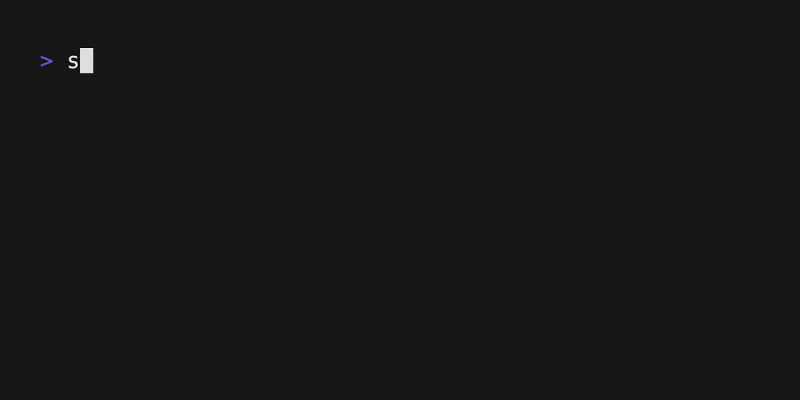

# sortvis

様々な sort アルゴリズムを terminal 上で可視化するための CLI です。



## インストール

[https://github.com/hamao0820/sortvis/releases](https://github.com/hamao0820/sortvis/releases)から最新の release を保存してください。

Mac OS の場合は、Homebrew でもインストールできます。

```sh
$ brew install hamao0820/tap/sortvis
```

## 遊び方

```sh
$ sortvis <subcommand> [options]
```

で様々な sort アルゴリズムを可視化できます。

### サブコマンド

subcommand には以下のものがあります。

で一覧を確認できます。

- `bubble`: バブルソート
- `selection`: 選択ソート
- `quick`: クイックソート
- `merge`: マージソート
- `heap`: ヒープソート
- `bucket`: バケットソート

次のフラグで確認することもできます。

```console
$ sortvis --ls
You can use the following algorithms(subcommands):
Bubble Sort(bubble)
Merge Sort(merge)
Heap Sort(heap)
Quick Sort(quick)
Selection Sort(selection)
Bucket Sort(bucket)
```

### オプション

- `--help`, `-h`: ヘルプを表示します。
- `--interactive`, `-i`: インタラクティブモードで実行します。このモードでは、ソートの過程を手動で進めることができます。スペースキーを押すと次のステップに進みます。
- `--num`, `-n`: ソートする配列のサイズを指定します。デフォルトは 50 です。0 < n < 100 　である必要があります。
- `--delay`, `-d`: ソートの遅延時間(ms)を指定します。デフォルトは 300 ミリ秒です。
- `--ls`: サブコマンドの一覧を表示します。
- `--file`, `-f`: ソートする配列をファイルから読み込みます。ファイルの形式は以下の通りです。

```txt
4
1
5
2
3
```
